# node-red-near-protocol

[](https://nodered.org)


This module provides nodes to call smart-contract methods from


## Add NEAR Protocol to your automation Node-RED Project.

### Install

To install the stable version use the `Menu` - `Manage palette` option and search for `node-red-near-protocol`, or run the following command in your Node-RED user directory - typically ~/.node-red:

```bash
npm i node-red-near-protocol
```

### Create your first flow

1. Add `Near Contract` node to workspase

   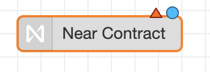

2. Double click it and configure contract.

   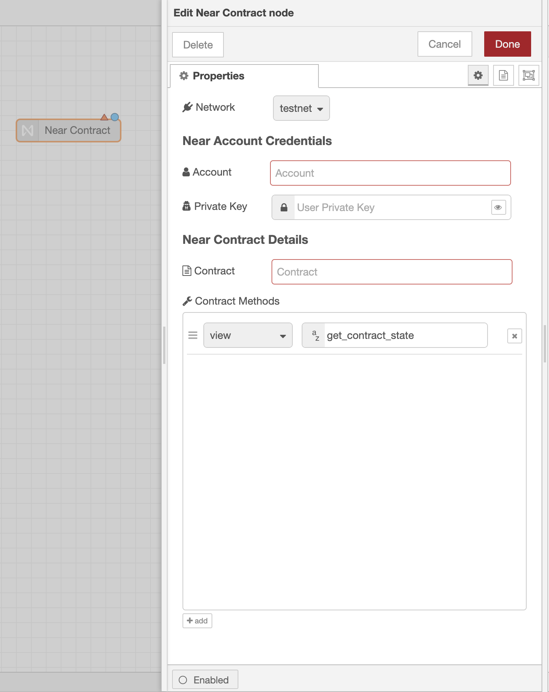

3. Set values to fields, fill in contract methods and press `Done`

   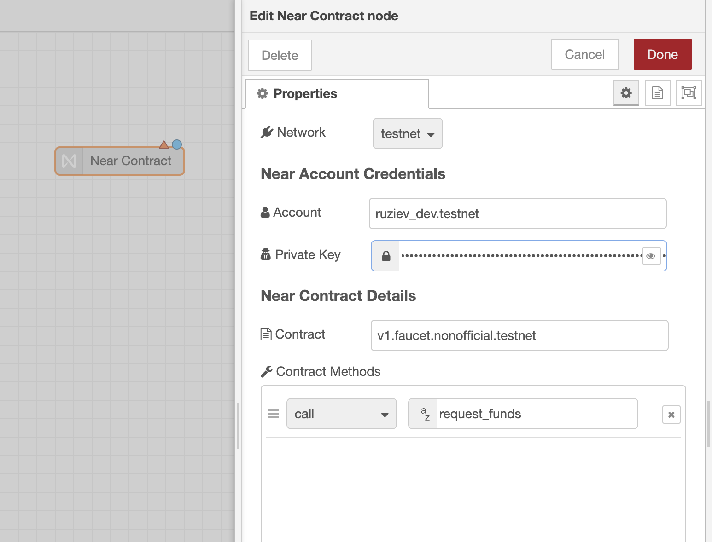

<details><summary>How to get your private key?</summary>
<li>Near Wallet
<p>
Open Browser DevTools go to tab <code>Application</code>, open <code>Local Storage</code> and find private key.
</p>
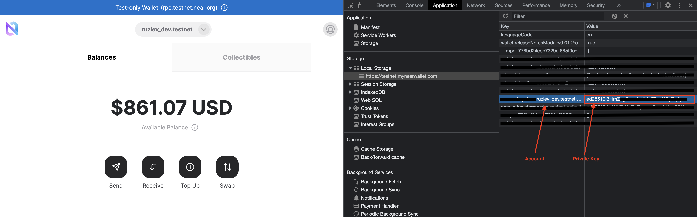
</li>
<li>
Another wallet
<p>
Go to <code>Settings</code> - <code>Backup Account</code> Choose export method <code>Private Key</code>
</p>
</details>

4. Press `Deploy` button. After succesful flow deploy you have to see similar contract node or error message.

   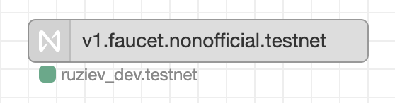

5. Add `Contract Method` node to workspase

   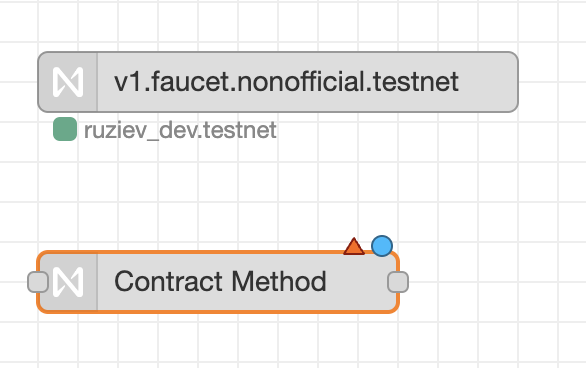

6. Double click it and configure method. Choose created before contract and method and press `Done`

   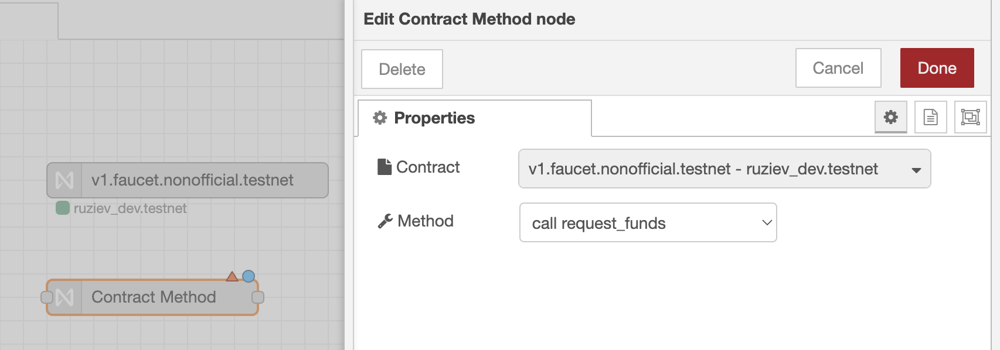

7. Method node has to change label

   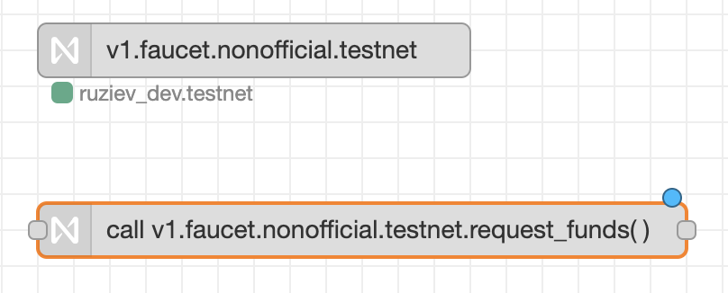

8. To call contract we have to emit some event and pass some arguments. To do it let't add standard `inject` node to a workspace.

   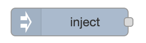

9. Set arguments to `payload` field and press `Done`

   

10. Add standart `debug` node to show result in debug console, connect nodes inputs and outputs and press `Deploy`. After that you can run contract by pressing to button on `inject` node.

    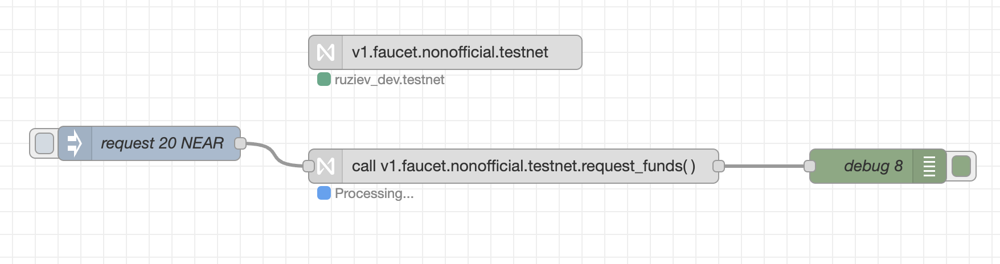

    Execution error will be displayed in debug console and as a contract node status

    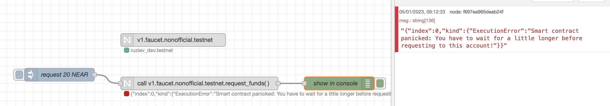

    Execution succes result will be transmitted to next node. If contract call does not return any result next node will get `{ payload: "completed" }`
    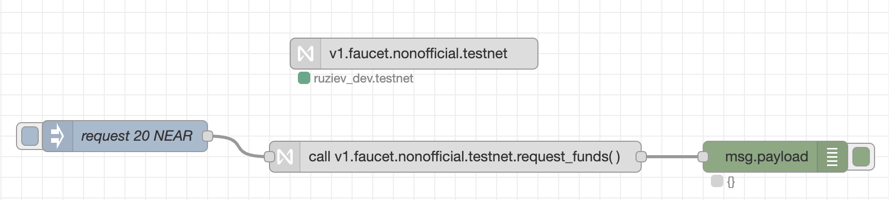
